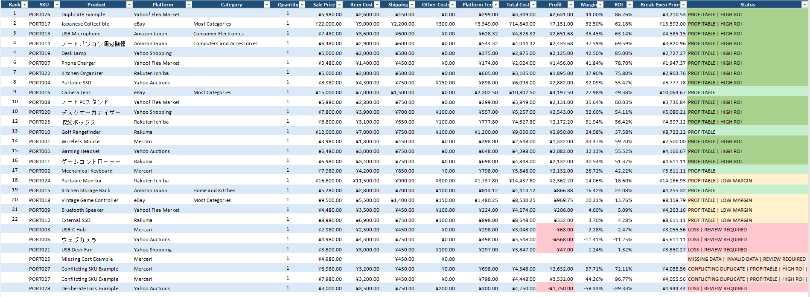
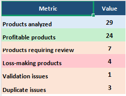

# EC Operations Tool

[日本語版はこちら](README_ja.md)

A Python tool for checking e-commerce product data, calculating profitability, ranking products, and exporting the results to Excel.

I built this around the type of product and marketplace data that comes up in EC operations work in Japan.

The tool reads product data from CSV or Excel, checks for missing values, invalid entries and duplicate records, then calculates marketplace fees, total costs, profit, margin, ROI and break-even price.

The results are exported as a formatted Excel workbook for review.

## Example Output

### Product Analysis



### Summary



## What it does

The tool currently handles:

- required-field and numeric-data checks
- missing-data detection
- invalid quantity and cost detection
- exact duplicate removal
- conflicting SKU detection
- marketplace-specific fee calculations
- total-cost calculation
- profit, margin and ROI calculation
- break-even price calculation
- automatic review flags
- product prioritization using profit, margin and ROI
- formatted Excel report generation
- English and Japanese report output

Current marketplace support:

- Mercari
- Yahoo! Auctions
- Yahoo! Flea Market
- Rakuma
- Amazon Japan
- eBay
- Yahoo! Shopping
- Rakuten Ichiba

Marketplace fee structures differ, so the tool does not apply one universal commission rate.

The current fee models support flat percentage fees, tiered fees, category-based fees, minimum fees, fixed order charges, international selling fees and monthly store costs.

## Example

English sample input:

`examples/sample_products_en.csv`

English sample report:

`examples/sample_analysis_en.xlsx`

The sample contains normal product records as well as intentionally problematic records so the validation and review workflow can be demonstrated.

These include:

- missing data
- exact duplicates
- conflicting SKUs
- low-margin products
- loss-making products
- English and Japanese product names
- multiple marketplaces

## Running the tool

Install the required packages:

```bash
pip install -r requirements.txt
```

Run the default input file:

```bash
python main.py
```

Run the English sample:

```bash
python main.py examples/sample_products_en.csv --lang en
```

Run the Japanese sample:

```bash
python main.py examples/sample_products_ja.csv --lang ja
```

Analyze another CSV or Excel file:

```bash
python main.py path/to/products.csv
```

Specify an output directory:

```bash
python main.py examples/sample_products_en.csv --lang en --output-dir reports
```

View command-line help:

```bash
python main.py --help
```

## Report Languages

English is the default report language.

```bash
python main.py products.csv --lang en
```

Japanese output can be generated with:

```bash
python main.py products.csv --lang ja
```

The same analysis logic is used for both versions.

When Japanese output is selected, worksheet names, report headers, status labels, summary labels and issue descriptions are localized for the Japanese report.

## Input Data

The input file uses the following columns:

```text
sku
product_name
platform
sale_price
item_cost
shipping_cost
other_costs
quantity
category
```

`category` is used by marketplaces such as Amazon Japan and eBay where fees can vary by product category.

Example:

```csv
sku,product_name,platform,sale_price,item_cost,shipping_cost,other_costs,quantity,category
PORT001,Wireless Mouse,Mercari,3980,1800,450,0,1,
PORT013,USB Microphone,Amazon Japan,7480,3600,600,0,1,Consumer Electronics
PORT016,Camera Lens,eBay,15000,7000,1500,0,1,Most Categories
```

Input column names remain in English so the same schema can be used regardless of the selected report language.

## Excel Output

The generated workbook contains five worksheets:

- Summary
- Product Analysis
- Scoring Detail
- Validation Issues
- Duplicate Issues

The Product Analysis sheet includes:

- sale price
- item cost
- shipping
- other costs
- marketplace fees
- total cost
- profit
- margin
- ROI
- break-even price
- status
- rank

Losses, low-margin products, review-required records and other important conditions are highlighted visually.

The workbook also uses alternating row shading, formatted currency and percentage fields, frozen headers and automatic column sizing for easier review.

## Product Ranking

Valid products can be ranked using configurable weights for:

- profit
- margin
- ROI

The final Priority Score is used to generate the product ranking.

Products with missing or invalid data, conflicting duplicates or other conditions that prevent reliable scoring are excluded from the final ranking.

## Configuration

Marketplace fee settings:

`config/platform_fees.json`

Analysis thresholds:

`config/analysis_rules.json`

Ranking weights:

`config/ranking_rules.json`

The fee and analysis rules are kept outside the main Python calculation logic so assumptions can be changed without rewriting the core application.

## Marketplace Fee Handling

Marketplace fees can depend on factors such as product category, transaction value, payment method, seller plan, sales volume and marketplace policy.

The project currently handles several different fee structures.

Mercari and similar marketplaces can use straightforward percentage-based fees.

Rakuma supports tiered fee logic.

Amazon Japan supports category-specific fees and minimum referral fees.

eBay fee handling includes category-based fees, fixed order charges, progressive fee thresholds and additional fees relevant to a Japan-based seller.

Yahoo! Shopping and Rakuten Ichiba include store-level costs and variable fee components. Fixed monthly costs are allocated using an estimated monthly order volume.

Because marketplace fee structures can change, the configuration should be reviewed before using the results for real financial decisions.

This is an EC operations and profitability-analysis tool, not an accounting or tax system.

## Automated Tests

The project uses pytest.

Run the full test suite with:

```bash
pytest -v
```

Current test result:

```text
23 passed
```

The tests currently cover:

- standard profitability calculations
- break-even price calculations
- missing financial data
- invalid quantities
- exact duplicate handling
- conflicting SKU handling
- unknown platforms
- disabled platforms
- loss detection
- ranking exclusions
- Yahoo! Flea Market fees
- Rakuma tiered fees
- Amazon Japan category fees
- Amazon Japan minimum fees
- eBay selling fees
- eBay international fees
- eBay break-even calculation
- Yahoo! Shopping store costs
- Rakuten Ichiba store costs

## Main Files

```text
main.py             Main workflow and command-line interface
data_loader.py      CSV / Excel loading
data_cleaner.py     Data validation and cleaning
duplicates.py       Duplicate handling
profitability.py    Profitability calculations
ebay_fees.py        eBay-specific fee calculations
store_fees.py       Store-level fixed and variable cost calculations
flags.py            Business and review flags
ranking.py          Product prioritization and ranking
exporter.py         Excel report generation and localization
tests/              Automated tests
config/             Fee, analysis and ranking settings
examples/           Sample input and output files
images/             README screenshots
```

## Development Notes

The project was built incrementally around a working EC analysis workflow rather than as a standalone calculation script.

During development, test data was used to check edge cases including missing values, invalid quantities, unsupported marketplaces, exact duplicates, conflicting SKUs, low-margin products and losses.

Marketplace-specific calculation logic is separated from the main workflow so additional fee models can be added without rewriting the entire application.

## Current Status

Version 1 is functionally complete.

The current version supports:

- CSV and Excel input
- data validation
- duplicate detection
- eight marketplaces
- multiple marketplace fee models
- profitability calculations
- product ranking
- formatted Excel reporting
- English and Japanese report output
- automated regression testing

The next stage of the project is focused on portfolio presentation, repository cleanup and further usability improvements.