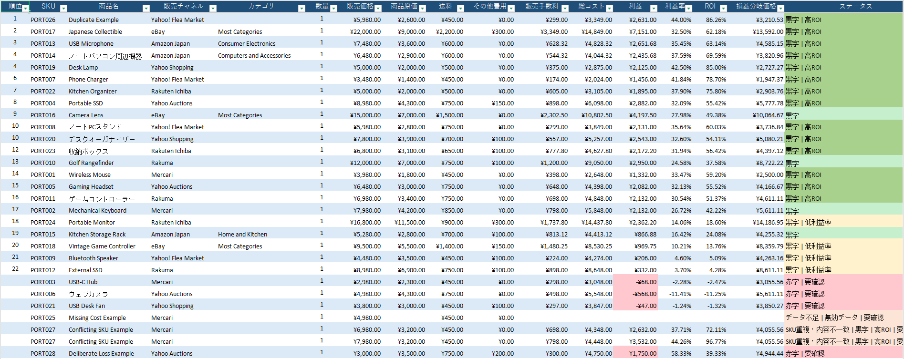
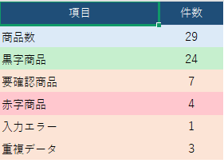

# EC Operations Tool

[English version](README.md)

EC運用で扱う商品データのチェック、利益計算、商品の優先度付けを行い、結果をExcel形式で出力するPythonツールです。

日本国内のEC業務で扱う商品データや販売チャネルを想定して作成しました。

CSVまたはExcelの商品データを読み込み、欠損値や入力ミス、重複データなどを確認したうえで、販売手数料、総コスト、利益、利益率、ROI、損益分岐価格などを計算します。

分析結果は、確認しやすいExcelレポートとして出力されます。

## 出力例

### 商品分析



### サマリー



## 主な機能

商品データを読み込み、以下の処理を行います。

- 必須項目・数値データのチェック
- 欠損データの検出
- 不正な数量・金額の検出
- 完全重複データの削除
- 同一SKUで内容が異なるデータの検出
- 販売チャネルごとの手数料計算
- 総コストの計算
- 利益・利益率・ROIの計算
- 損益分岐価格の計算
- 要確認データの自動フラグ付け
- 利益・利益率・ROIを使った商品の優先度付け
- Excelレポートの出力
- 英語・日本語レポートの切り替え

現在対応している販売チャネルは以下です。

- Mercari
- Yahoo! Auctions
- Yahoo! Flea Market
- Rakuma
- Amazon Japan
- eBay
- Yahoo! Shopping
- Rakuten Ichiba

販売手数料の仕組みは販売チャネルごとに異なるため、すべてを同じ計算式で処理するのではなく、それぞれの料金体系に合わせて設定できる構成にしています。

現在は、定率手数料、段階制手数料、カテゴリ別手数料、最低手数料、注文ごとの固定手数料、海外販売手数料、月額固定費などに対応しています。

## サンプル

日本語版のサンプル入力：

`examples/sample_products_ja.csv`

日本語版のサンプル分析レポート：

`examples/sample_analysis_ja.xlsx`

サンプルデータには、通常の商品データに加えて、動作確認用として以下のようなデータも含めています。

- 欠損データ
- 完全重複
- 同一SKUの内容不一致
- 低利益率商品
- 赤字商品
- 日本語の商品名
- 複数の販売チャネル

これにより、データチェックから分析、要確認判定までの流れを確認できます。

## 実行方法

必要なライブラリをインストールします。

```bash
pip install -r requirements.txt
```

デフォルトの入力ファイルを使用する場合：

```bash
python main.py
```

日本語版のサンプルを実行する場合：

```bash
python main.py examples/sample_products_ja.csv --lang ja
```

別のCSVまたはExcelファイルを指定する場合：

```bash
python main.py path/to/products.csv --lang ja
```

出力先を指定する場合：

```bash
python main.py examples/sample_products_ja.csv --lang ja --output-dir reports
```

ヘルプを表示する場合：

```bash
python main.py --help
```

英語レポートを出力する場合は、`--lang en` を指定します。

## 入力データ

入力ファイルでは以下の列を使用します。

```text
sku
product_name
platform
sale_price
item_cost
shipping_cost
other_costs
quantity
category
```

`category` は、Amazon JapanやeBayなど、商品カテゴリによって手数料が変わる販売チャネルで使用します。

例：

```csv
sku,product_name,platform,sale_price,item_cost,shipping_cost,other_costs,quantity,category
PORT001,Wireless Mouse,Mercari,3980,1800,450,0,1,
PORT013,USB Microphone,Amazon Japan,7480,3600,600,0,1,Consumer Electronics
PORT016,Camera Lens,eBay,15000,7000,1500,0,1,Most Categories
```

入力ファイルの列名は、処理の一貫性を保つため英語のまま使用します。

日本語出力を指定した場合、Excelレポート内のシート名、見出し、ステータス、エラー内容などが日本語で表示されます。

## 出力レポート

Excelレポートには以下のシートが含まれます。

- サマリー
- 商品分析
- スコア詳細
- 入力エラー
- 重複データ

商品分析シートでは、主に以下の項目を確認できます。

- 販売価格
- 商品原価
- 送料
- その他費用
- 販売手数料
- 総コスト
- 利益
- 利益率
- ROI
- 損益分岐価格
- ステータス
- 順位

赤字、低利益率、要確認データなどは色分けして表示されます。

## 設定ファイル

販売チャネルごとの手数料設定：

`config/platform_fees.json`

商品分析の判定基準：

`config/analysis_rules.json`

商品優先度付けの重み：

`config/ranking_rules.json`

手数料や分析基準をPythonコードから分離しているため、条件を変更する場合でも計算ロジック本体を直接修正する必要はありません。

## 手数料について

ECモールやマーケットプレイスの手数料は、カテゴリ、販売金額、決済方法、契約プラン、販売実績、キャンペーンなどによって変更される場合があります。

そのため、このツールでは販売チャネルごとの条件を設定ファイルで管理しています。

Yahoo! ShoppingやRakuten Ichibaのように月額固定費があるサービスについては、1注文あたりのコストを計算するために月間注文数の想定値を使用しています。

eBayについては、固定注文手数料、段階制手数料、海外販売に関する追加費用などを個別に計算します。

実際の業務で使用する場合は、最新の料金体系や自社の契約条件に合わせて設定内容を確認・更新する必要があります。

このツールはEC運用・収益分析を目的としたもので、会計・税務処理を行うシステムではありません。

## 自動テスト

pytestを使用して自動テストを行っています。

```bash
pytest -v
```

現在のテスト結果：

```text
23 passed
```

主なテスト内容：

- 利益計算
- 損益分岐価格の計算
- 欠損データ
- 不正な数量
- 完全重複
- 同一SKUの内容不一致
- 未登録の販売チャネル
- 無効化された販売チャネル
- 赤字判定
- 商品の優先度付け
- Yahoo! Flea Marketの手数料
- Rakumaの段階制手数料
- Amazon Japanのカテゴリ別手数料
- Amazon Japanの最低手数料
- eBayの販売手数料
- eBayの海外販売手数料
- eBayの損益分岐価格
- Yahoo! Shoppingの店舗コスト
- Rakuten Ichibaの店舗コスト

## 主なファイル

```text
main.py             メイン処理・コマンドライン
data_loader.py      CSV / Excel読込
data_cleaner.py     データ検証・クリーニング
duplicates.py       重複データ処理
profitability.py    利益計算
ebay_fees.py        eBay用手数料計算
store_fees.py       モール型ECの固定費・変動費計算
flags.py            判定・要確認フラグ
ranking.py          商品順位付け
exporter.py         Excelレポート出力・日本語対応
tests/              自動テスト
config/             手数料・分析設定
examples/           サンプル入力・出力
images/             README用スクリーンショット
```

## 補足

このプロジェクトは、EC運用業務で扱うデータ処理や収益確認を効率化することを目的として作成しています。

現在のバージョンでは、商品データの取込からデータチェック、手数料計算、利益分析、優先度付け、Excelレポート出力までを一通り実行できます。

英語版と日本語版のレポートを同じ分析ロジックから生成できるため、日本語・英語の両方の環境で利用できる構成にしています。